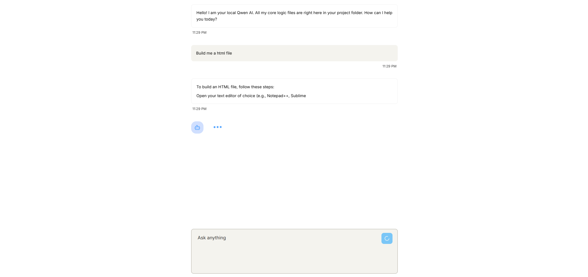
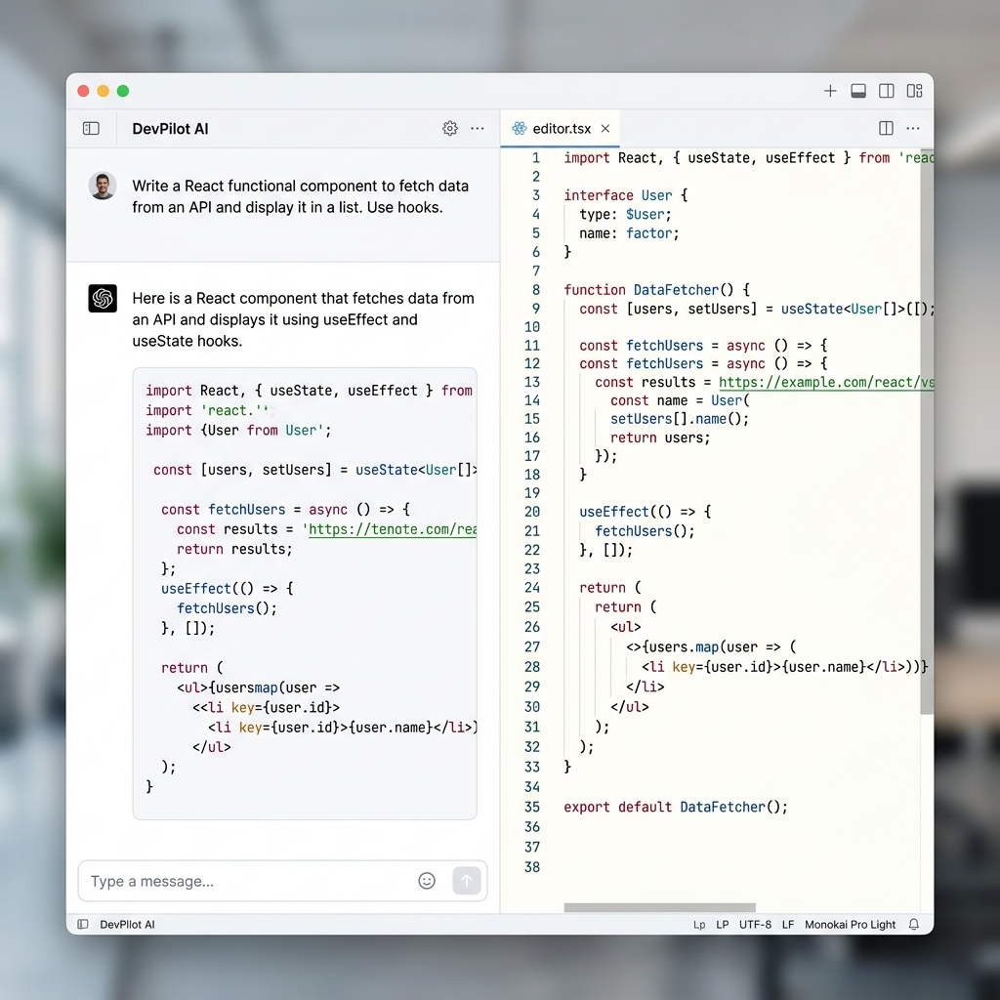

# Xb36: Democratizing Local AI



Xb36 is a high-performance, locally-hosted AI chat interface designed to bring the power of LLMs to everyone—regardless of their hardware. By prioritizing ultra-lightweight models and a premium web-based UI, Xb36 eliminates the complexity of terminal-based AI and the cost of cloud APIs.

## 🚀 The Vision
The AI industry is dominated by massive, gated models that require expensive hardware. **Xb36 changes that.** 
*   **Accessible to All**: Runs smoothly on standard CPUs and older laptops.
*   **Fully Transparent**: 100% of the model logic and UI files are in your hands.
*   **Zero Cost**: No API keys, no subscriptions, no data tracking.

## ✨ Key Features
*   **Side-by-Side Live Coding**: Watch the AI write code in a dedicated, high-contrast panel while you chat.
*   **Premium Web Interface**: A modern Next.js 15+ frontend that replaces clunky terminal windows.
*   **Ultra-Fast Streaming**: Real-time word-by-word responses powered by a lightweight Python backend.
*   **Developer-First Design**: Professional syntax highlighting and a clean, minimalist aesthetic.



## 🏃 Getting Started

### 1. Start the AI Backend
```powershell
python model/bridge.py
```

### 2. Start the Web Interface
```powershell
npm run dev
```
Open [http://localhost:3000](http://localhost:3000) to start chatting.
